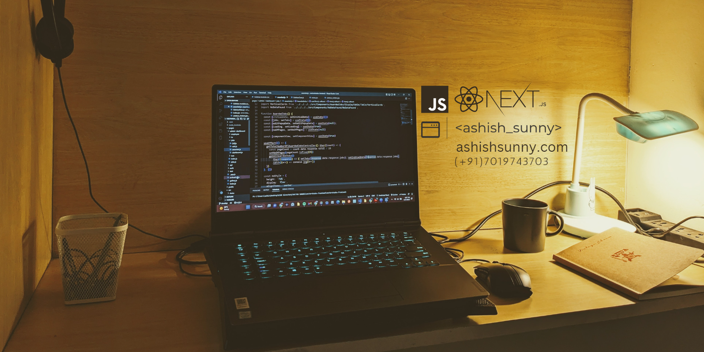

<h1 align="center">Hiya 🙋🏻‍♂️, I'm ash👾</h1>
<h3 align="center">I am a frontend dev based on Bangalore!🌷</h3>

- 🔭 I’m currently working on a [customized invoice application(NextJS, TS)](https://github.com/ashishsunny/invoice-app)

- 🌱 I’m currently learning **typescript and a little bit of backend**

- 👨‍💻 Some of my projects are available at [ashishsunny.dev](ashishsunny.dev)

- 💬 Ask me about **frontend engineering**

- 📫 You can reach me at **ashishsunny.dev@gmail.com**

- 📄 Know about my experiences [ashishsunny.dev](ashishsunny.dev)

<h3 align="left">Connect with me🤝:</h3>

<h3 align="left">Languages, Frameworks and Libraries💻 :</h3>

<!-- 

 -->

&nbsp;

